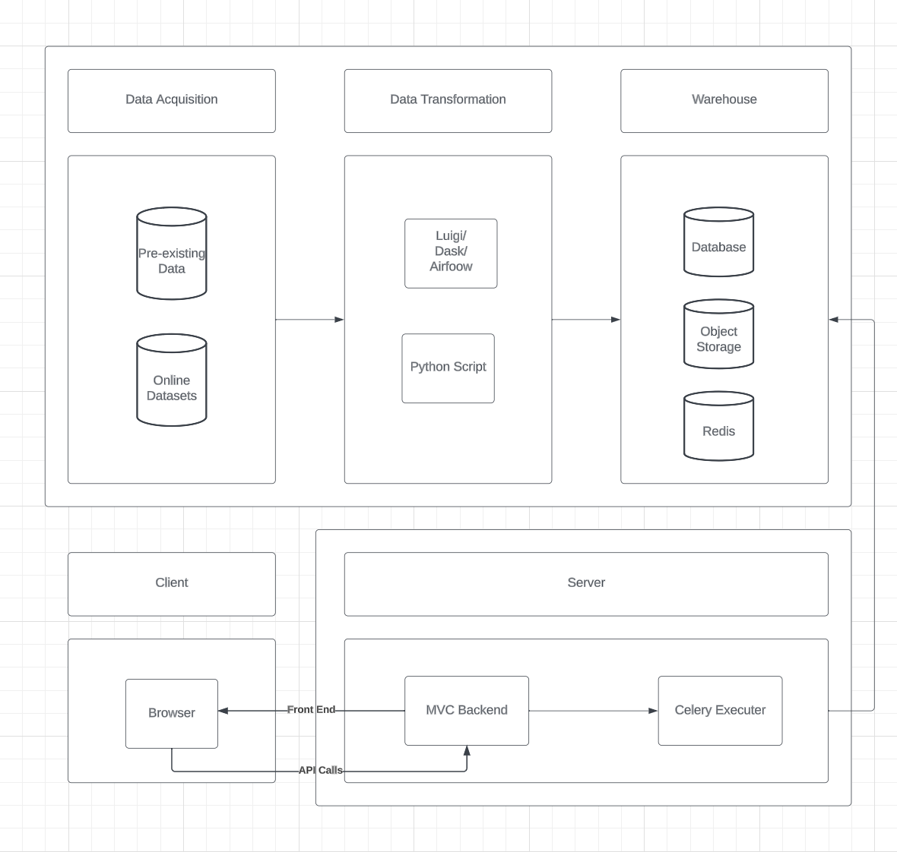
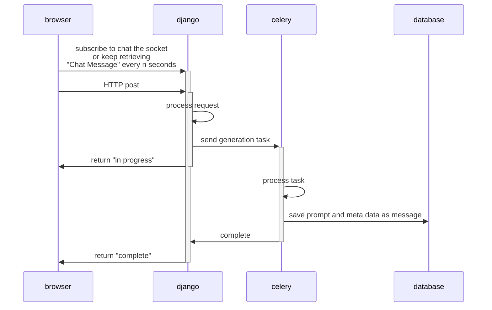
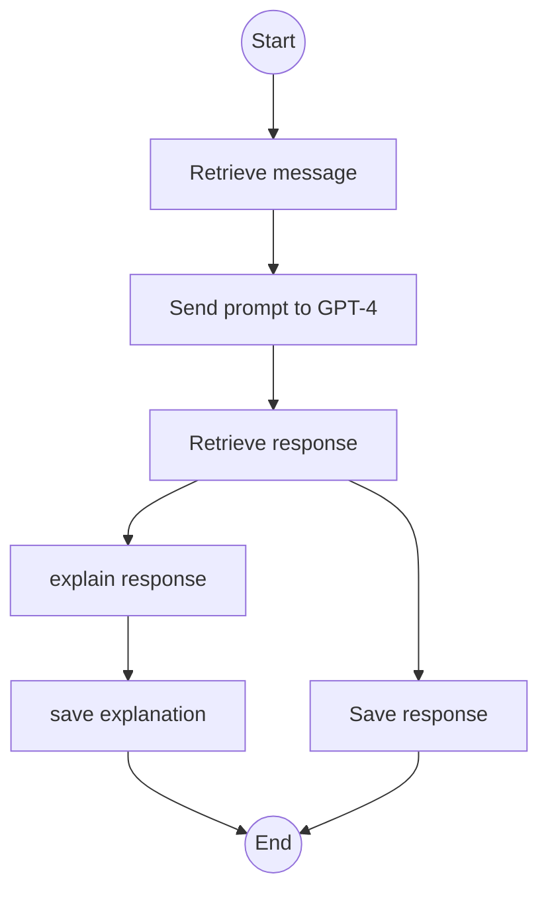
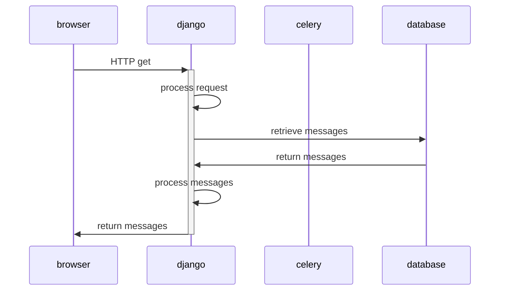

# TAP

# Introduction

This is a project for TAP course in University of Swinburne. The project aim is to build a chatbot that could respond with a proper answer to the user's question about medical concerns. The chatbot is built using OpenAI GPT-4 and the server is built using Django. 

# Architecture and Data Flow


The Architecture uses Django as Frontend Server and API server. Additionally, celery was integrated into the architecture to handle asynchronous tasks such as prompt generation and chat message retrieval. The architecture uses PostgreSQL/SQLite as the database.


# API
## Prompt Generation

[socket](https://stackoverflow.com/questions/4190186/can-i-use-socket-io-with-django)
## Prompt Generation Task


## Chat Message

# Project Structure
```

django-server - Django server

pipeline - ETL pipeline

```

# Requirements
1. poetry


# Installation
## django-server
1. change directory to django-server
```bash
cd django-server
```
2. install dependencies using poetry
```bash
poetry install
```
this will install all dependencies in poetry.lock file


# Run and Develop
## Run on host machine
1. change directory to django-server
```bash
cd django-server
``` 
2. run migration for the first time
```bash
 ## python manage.py makemigrations && python manage.py migrate
 sh run.migrate.sh
```
3. run server
```bash
## python manage.py runserver
sh run.development.sh 
```
<!-- 
4. run celery worker
```bash
## celery -A django-server worker -l info
sh run.celery.sh
```
5. run celery beat
```bash
## celery -A django-server beat -l info
sh run.celery.beat.sh
``` -->

# ETL